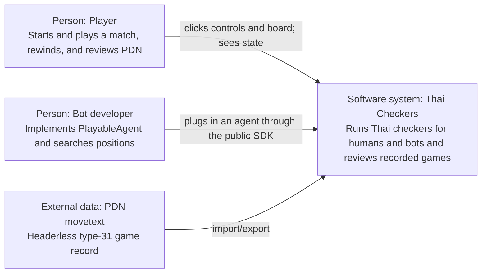
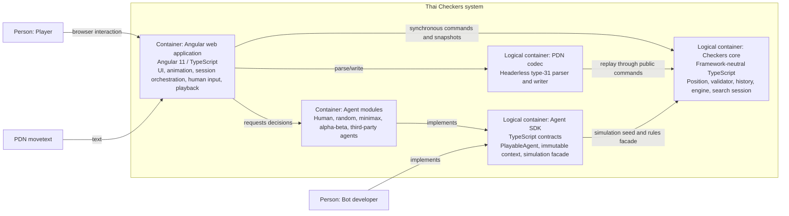
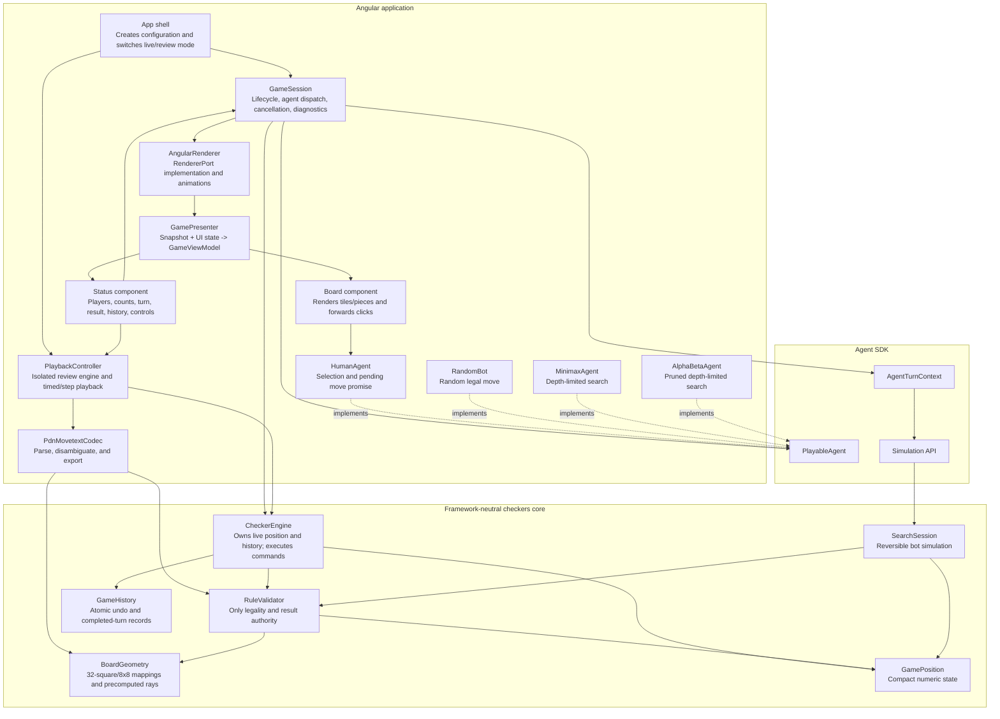
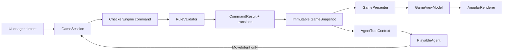

# C4 Architecture

The diagrams use ordinary Mermaid flowcharts so they render in environments that do not enable Mermaid's experimental C4 syntax. Each node is labelled with its C4 role. The core is an in-process TypeScript library bundled with the Angular application; it is shown as a separate logical container to make its dependency boundary explicit.

## Level 1 — System context

There is no server or external data store. All state exists in the browser process. A bot can also instantiate the framework-neutral core in a unit test or Web Worker without Angular.

## Level 2 — Containers

The logical containers can remain folders in the existing application initially. Their public barrel files enforce the same boundaries that separate packages would use later.

## Level 3 — Components

## Dependency rules

1. Core files may depend only on other core files and TypeScript/ECMAScript primitives.
2. `RuleValidator` has no reference to `CheckerEngine`; it operates on supplied position and rule context values.
3. `SearchSession` may mutate only its private copied position and undo arrays. It shares immutable geometry and the same validator implementation with live play.
4. The agent SDK exposes readonly data and simulation operations, never concrete core storage.
5. Agents depend on the SDK, not on Angular, `GameSession`, `CheckerEngine`, renderer implementations, or other agents.
6. The PDN codec produces parsed paths and diagnostics. It does not mutate a live engine; `PlaybackController` applies paths to its review engine.
7. `GamePresenter` is the only place that expands the 32-square position into the object-rich view required by existing Angular templates.
8. Angular components do not call rule methods. They render `GameViewModel` and send user/application intents.

## Control and data flow

Only the path through `CheckerEngine` can mutate a live game. Rendering, agent computation, parsing, and selection are replaceable adapters around that boundary.
