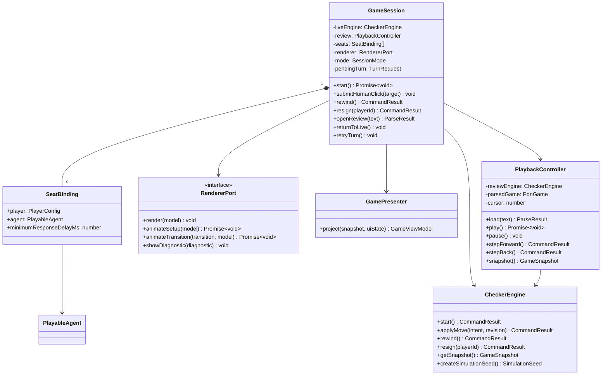
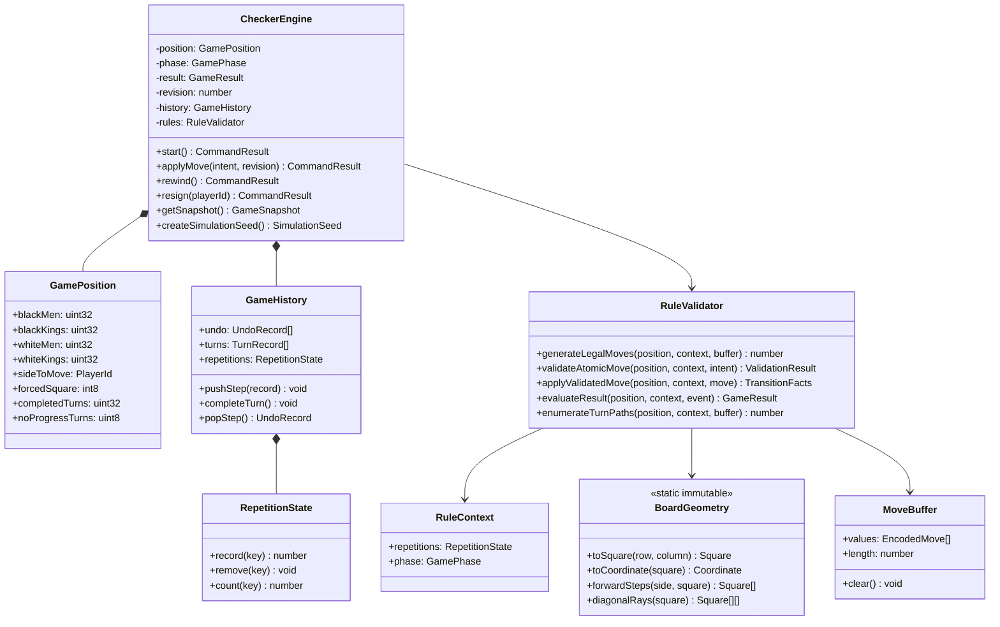
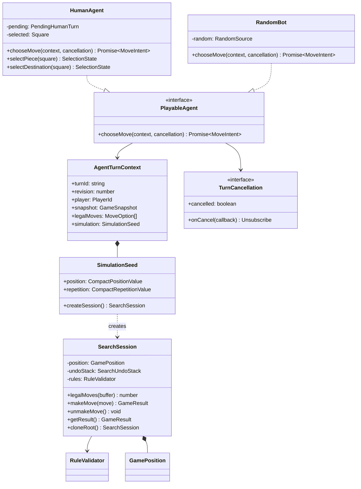
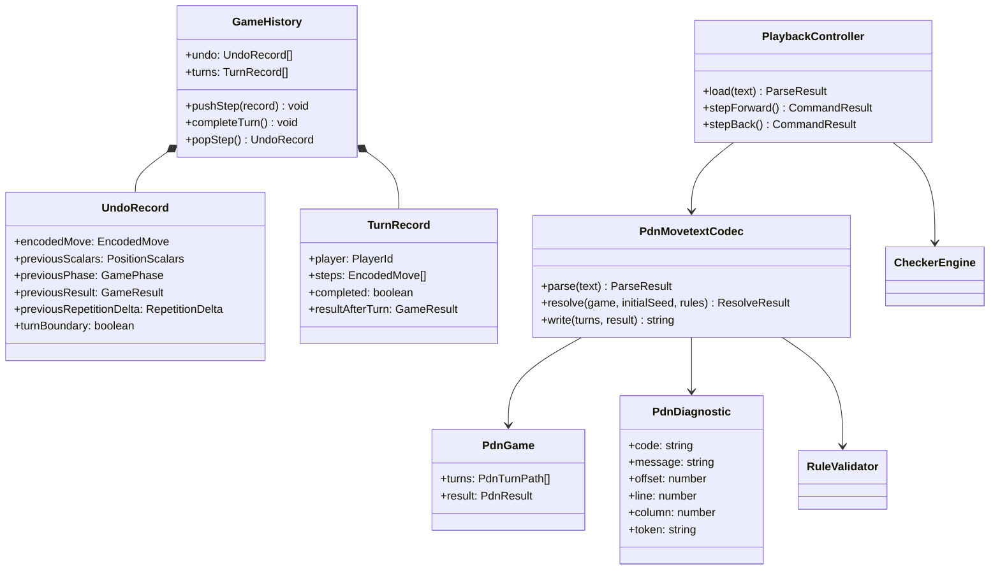
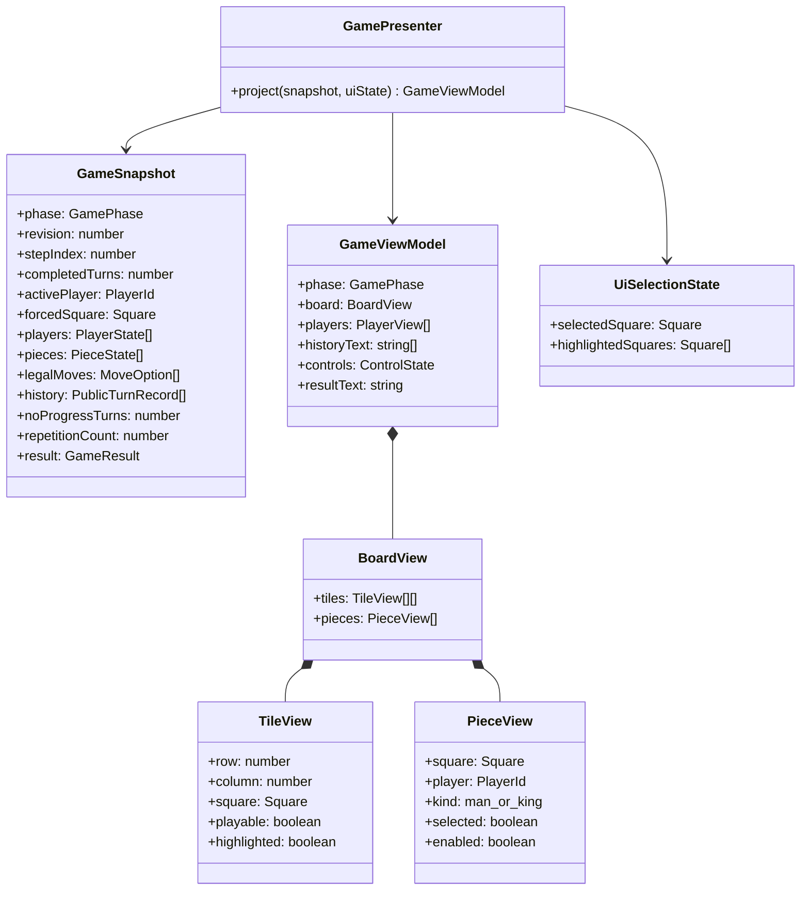

# Class Model and Public Contracts

The class model deliberately separates four kinds of object:

- application objects coordinate asynchronous work;
- core objects synchronously validate and mutate a game;
- agent objects choose an intent from immutable public information;
- presentation objects are disposable projections for Angular.

Names in this document are the target API. The future implementation may split declarations across files, but it must preserve the ownership and dependency directions shown here.

## Application session and ports



`GameSession` is the replacement for the orchestration work currently concentrated in `Checker`. It owns pending promises and cancellation. It never edits a position itself.

`RendererPort` is intentionally outside the engine. `render` receives the complete current model; transition animation is decorative and must not become an alternative state store.

## Core state and rules



### Position invariants

- The four masks are disjoint and normalized with `>>> 0` after bitwise operations.
- Bits `0..31` correspond exactly to PDN squares `1..32`; bit `n` represents square `n + 1`.
- `forcedSquare` is `-1` outside a capture continuation. Otherwise it identifies a piece owned by `sideToMove` and legal moves contain captures by only that piece.
- `completedTurns` increases only when control passes to the opponent. It does not increase between jumps.
- `noProgressTurns` is `0..50`; it resets when the completed turn contained a capture or moved a man, otherwise it increments once.
- The initial completed-turn position key is recorded before play. Repetition keys include the four masks and side to move.
- `phase` and `result` live in `CheckerEngine`, not in `GamePosition`, so search can copy the hot position fields densely.

### Packed move layout

`EncodedMove` is a TypeScript `number` treated as an unsigned integer:

| Bits | Value |
| --- | --- |
| `0..4` | source square index `0..31` |
| `5..9` | destination square index `0..31` |
| `10..14` | captured square index; ignored for a quiet move |
| `15` | capture flag |
| `16` | promotion flag |

Promotion is computed by the validator and included in the encoded move returned by validation; callers cannot request promotion. Turn completion is derived after applying the move because it depends on promotion and remaining captures.

### Commands and results

```ts
type PlayerId = 'black' | 'white';
type GamePhase = 'ready' | 'active' | 'ended';

interface MoveIntent {
    readonly from: number; // PDN square 1..32
    readonly to: number;   // PDN square 1..32
}

type GameResult =
    | { readonly status: 'ongoing' }
    | {
        readonly status: 'win';
        readonly winner: PlayerId;
        readonly loser: PlayerId;
        readonly reason: 'no-pieces' | 'no-legal-move' | 'resignation';
      }
    | {
        readonly status: 'draw';
        readonly reason: 'threefold-repetition' | 'fifty-turn-rule';
      };

type CommandResult =
    | {
        readonly accepted: true;
        readonly snapshot: GameSnapshot;
        readonly transition: GameTransition;
      }
    | {
        readonly accepted: false;
        readonly code: 'not-active' | 'stale-revision' | 'illegal-move' |
            'wrong-player' | 'nothing-to-rewind';
        readonly snapshot: GameSnapshot;
      };
```

Every rejected command is observationally non-mutating. `revision` increases for every accepted state change, including rewind; `stepIndex` follows the atomic-history cursor and therefore decreases on rewind.

`RuleValidator.evaluateResult` is the only method allowed to construct a non-ongoing live result. `CheckerEngine.resign` supplies a resignation event to that method rather than constructing a result itself.

## Agents and simulation



`GameSnapshot`, `legalMoves`, and `SimulationSeed` are copies. Their TypeScript declarations are deeply readonly, and development/test builds freeze snapshot projections. Mutating an agent-owned copy cannot affect the live game.

`SearchSession` is intentionally synchronous. After construction, `legalMoves`, `makeMove`, and `unmakeMove` reuse caller/session storage and must not create snapshots, history strings, promises, or UI notifications.

### Minimal custom bot

```ts
import {
    AgentTurnContext,
    MoveIntent,
    PlayableAgent,
    TurnCancellation
} from './agent-api';

export class FirstLegalBot implements PlayableAgent {
    async chooseMove(
        context: AgentTurnContext,
        cancellation: TurnCancellation
    ): Promise<MoveIntent> {
        if (cancellation.cancelled) {
            throw new Error('Turn cancelled');
        }

        const move = context.legalMoves[0];
        return { from: move.from, to: move.to };
    }
}
```

### Seat configuration

```ts
const session = new GameSession({
    seats: [
        {
            player: { id: 'black', name: 'Alice', color: '#444444' },
            agent: new HumanAgent(),
            minimumResponseDelayMs: 0
        },
        {
            player: { id: 'white', name: 'Search Bot', color: '#e26b6b' },
            agent: new MyMinimaxBot(),
            minimumResponseDelayMs: 500
        }
    ],
    engine: CheckerEngine.createThaiGame(),
    renderer: new AngularRenderer()
});
```

No constructor inside the engine chooses concrete agents.

`minimumResponseDelayMs` is presentation pacing owned by `GameSession`; it defaults to `500` for the bundled random-bot seat and `0` otherwise. It never delays a bot's computation, appears in a simulation, or introduces timers into the core.

## History, rewind, and PDN



One `UndoRecord` is written before every atomic state mutation. A partial capture chain is held in the current `TurnRecord`; completing the turn seals it. Rewind opens a sealed record when reversing its final step and restores the same mover and forced piece when the preceding state was mid-chain.

PDN is a projection of `TurnRecord[]`, never the source of undo data. Playback parses complete turn paths and expands them back into validated atomic intents.

## Immutable snapshots and UI projections



Selection and highlighting are not rules state. `HumanAgent` derives them only from the legal moves in its current context, and `GamePresenter` merges them into a disposable view model. After every accepted transition, invalid click, cancellation, or mode switch, the selection state is cleared or rebuilt from the new context.
