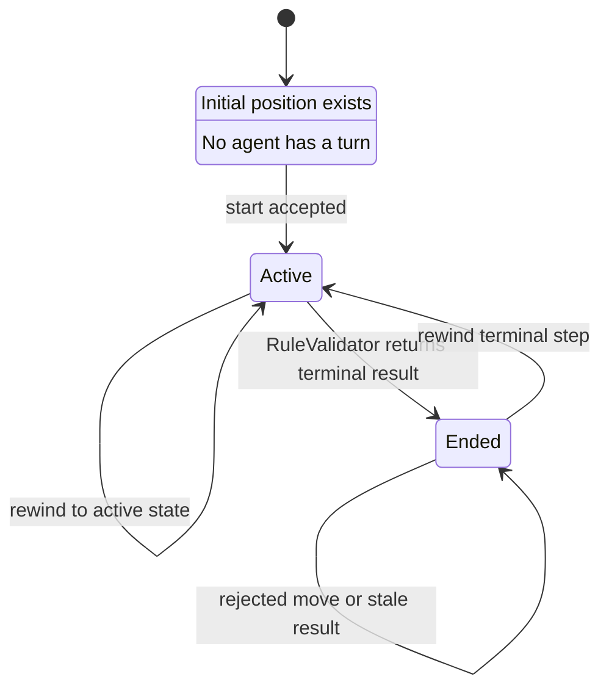
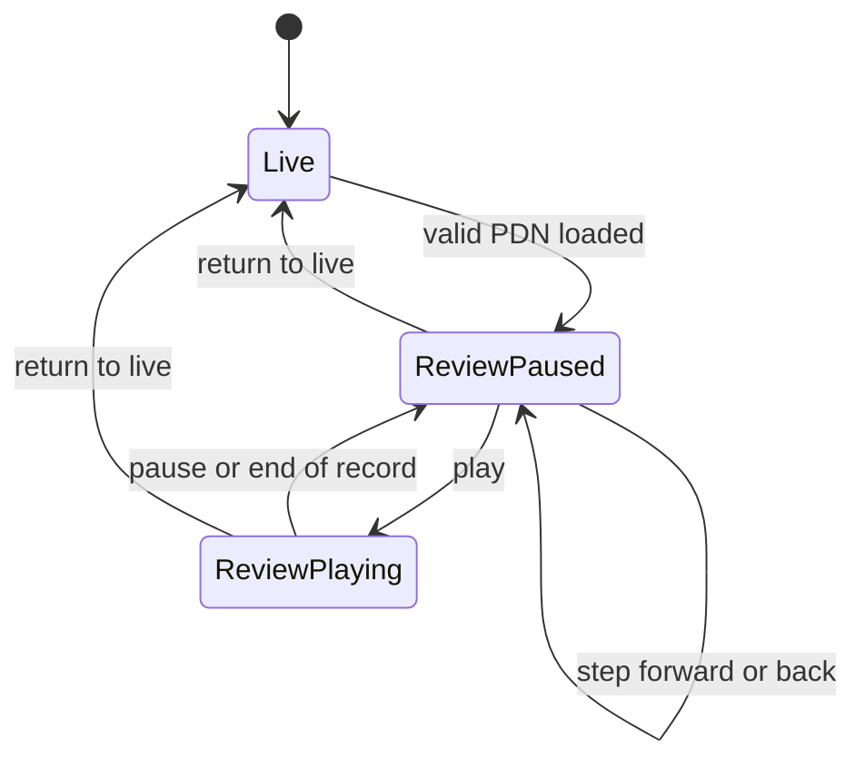
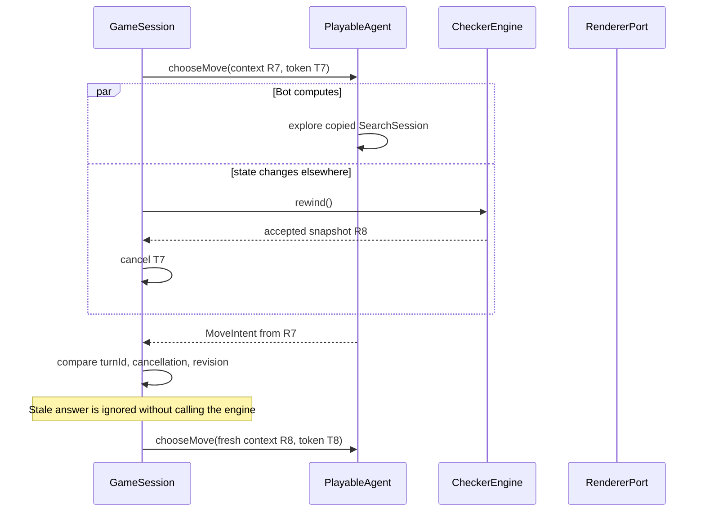

# Runtime Flows

These flows define ordering and ownership. A renderer may animate between snapshots, but the accepted engine snapshot is always the source of truth.

## Engine and session states



Review mode is a `GameSession` mode, not an engine phase:



The live engine remains allocated and unchanged while either review state is active.

## Start and setup animation

```mermaid
sequenceDiagram
    actor Player
    participant UI as Angular UI
    participant Session as GameSession
    participant Engine as CheckerEngine
    participant Renderer as RendererPort
    participant Black as Black PlayableAgent

    Player->>UI: Click Start
    UI->>Session: start()
    Session->>Engine: getSnapshot()
    Engine-->>Session: READY initial snapshot
    Session->>Renderer: animateSetup(view model)
    Note over Session,Renderer: Start is disabled; no agent is dispatched
    Renderer-->>Session: animation complete
    Session->>Engine: start()
    Engine-->>Session: accepted ACTIVE snapshot, revision + 1
    Session->>Renderer: render(active view model)
    Session->>Black: chooseMove(context, cancellation)
```

Double-clicking Start while animation is running is ignored by `GameSession`. If animation fails, the engine remains `READY`, a diagnostic is shown, and Start becomes available again.

## Human selection and submission

```mermaid
sequenceDiagram
    actor Player
    participant Board as BoardComponent
    participant Human as HumanAgent
    participant Session as GameSession
    participant Engine as CheckerEngine
    participant Rules as RuleValidator
    participant Renderer as RendererPort

    Session->>Human: chooseMove(context, cancellation)
    Player->>Board: Click own active piece
    Board->>Human: selectPiece(square)
    Human-->>Renderer: selection from context.legalMoves
    Renderer-->>Board: render selected piece and destinations

    alt permissible destination
        Player->>Board: Click highlighted tile
        Board->>Human: selectDestination(square)
        Human-->>Session: resolve MoveIntent
        Session->>Engine: applyMove(intent, context.revision)
        Engine->>Rules: validate and apply
        Rules-->>Engine: transition facts and GameResult
        Engine-->>Session: accepted snapshot and transition
        Session->>Renderer: animateTransition then render
    else impermissible destination
        Player->>Board: Click non-highlighted tile
        Board->>Human: selectDestination(square)
        Human-->>Renderer: cleared selection/highlights
        Note over Human: Pending turn remains; player must select again
    end
```

Clicking an inactive/opponent piece has the same clearing behavior as any impermissible target. Clicking another selectable own piece replaces the selection and highlights that piece's legal destinations.

The context already enforces compulsory capture. A piece with only quiet pseudo-moves cannot be selected when any friendly piece can capture.

## Capture continuation, promotion, and turn completion

```mermaid
sequenceDiagram
    participant Session as GameSession
    participant Engine as CheckerEngine
    participant Rules as RuleValidator
    participant Renderer as RendererPort
    participant Agent as Current PlayableAgent
    participant Next as Opponent PlayableAgent

    Session->>Engine: applyMove(one jump, revision)
    Engine->>Rules: validateAtomicMove()
    Rules-->>Engine: encoded capture
    Engine->>Rules: applyValidatedMove()
    Rules-->>Engine: captured piece removed; promotion/continuation facts

    alt man was promoted
        Note over Rules: Promotion ends the turn immediately
        Engine->>Rules: evaluateResult(completed turn)
        Engine-->>Session: snapshot with opponent to move or ENDED
    else same piece can capture again
        Engine->>Rules: generate captures for moved piece only
        Engine-->>Session: ACTIVE snapshot with forcedSquare
        Session->>Renderer: render piece preselected and legal landings
        Session->>Agent: chooseMove(new context, new cancellation)
    else capture chain is complete
        Engine->>Rules: evaluateResult(completed turn)
        Engine-->>Session: snapshot with opponent to move or ENDED
    end

    opt game remains active and turn changed
        Session->>Next: chooseMove(context, cancellation)
    end
```

Captured pieces disappear in each accepted jump, not at the end of the chain. The history accumulates atomic steps in one open turn record. Repetition and the no-progress counter update only when that record is completed.

## Terminal result and resignation

After an atomic move, `RuleValidator` evaluates in this order:

1. If the opponent has no pieces, the mover wins.
2. At a completed turn, if the opponent has no legal move, the mover wins.
3. At a completed turn, if the resulting position key reaches its third occurrence, the game is drawn.
4. At a completed turn, if `noProgressTurns` reaches 50, the game is drawn.
5. Otherwise the result is ongoing.

A promotion that ends the turn follows the same order. A resignation command supplies the active player as an adjudication event to `RuleValidator`, which returns the opponent as winner.

When a terminal result is returned, `GameSession` cancels the outstanding turn, renders all pieces as disabled, stops dispatch, and displays the configured winner name or draw reason. PDN review result metadata cannot end a live engine.

## Bot dispatch and cancellation



The same cancellation occurs on accepted moves, resignation, game end, review entry, return from review, and session disposal.

- An illegal current-revision move is passed to the engine and rejected without mutation. The session reports the diagnostic and may dispatch a fresh context.
- A rejected promise or thrown agent error leaves the game active but pauses automatic dispatch. The UI exposes Retry Turn; retry creates a new token for the unchanged revision.
- Retries are user/application initiated after exceptions, preventing a defective bot from creating an infinite rejection loop.

## Rewind one atomic step

```mermaid
sequenceDiagram
    actor Player
    participant Session as GameSession
    participant Engine as CheckerEngine
    participant History as GameHistory
    participant Rules as RuleValidator
    participant Renderer as RendererPort
    participant Agent as Restored PlayableAgent

    Player->>Session: rewind()
    Session->>Session: cancel pending turn
    Session->>Engine: rewind()
    Engine->>History: popStep()
    alt no undo record
        History-->>Engine: none
        Engine-->>Session: nothing-to-rewind, unchanged snapshot
    else record exists
        History-->>Engine: complete prior fields and deltas
        Engine->>Engine: restore masks, side, forced square, counters, phase/result
        Engine->>History: reverse repetition/turn-record changes
        Engine->>Rules: regenerate legal moves for restored state
        Engine->>Engine: revision + 1; stepIndex - 1
        Engine-->>Session: accepted snapshot and rewind transition
        Session->>Renderer: animateTransition then render
        Session->>Agent: chooseMove(restored context, new token)
    end
```

Rewinding the final jump of a completed chain reopens that turn and restores the mover's forced continuation. Rewinding a terminal move restores `ACTIVE`; rewinding stops safely at the initial position. There is no redo stack.

## PDN import and isolated playback

```mermaid
sequenceDiagram
    actor Player
    participant UI as Log section
    participant Session as GameSession
    participant Playback as PlaybackController
    participant Codec as PdnMovetextCodec
    participant Review as Review CheckerEngine
    participant Rules as RuleValidator
    participant Renderer as RendererPort

    Player->>UI: Paste movetext and click Review
    UI->>Session: openReview(text)
    Session->>Playback: load(text)
    Playback->>Codec: parse(text)
    Codec-->>Playback: paths/result or located diagnostics
    Playback->>Review: create fresh READY engine
    Playback->>Review: start()
    loop every PDN player turn
        Playback->>Rules: resolve path against legal complete turn paths
        Rules-->>Playback: exact atomic sequence or diagnostic
        Playback->>Review: apply each atomic MoveIntent
    end
    Playback->>Review: rewind to initial review cursor
    Playback-->>Session: valid review ready
    Session->>Session: preserve live engine; switch mode
    Session->>Renderer: render review start

    Player->>Playback: Play or Step Forward
    Playback->>Review: apply next validated atomic step(s)
    Playback->>Renderer: animate review transition

    Player->>Session: Return to Live
    Session->>Playback: pause and dispose review
    Session->>Renderer: render preserved live snapshot
    Session->>Session: dispatch live active agent with fresh token
```

Loading is transactional: parse or legality failure discards the temporary review engine and leaves both the live game and current UI mode unchanged. Human and bot input are disabled while review mode is visible; playback controls alone may advance or rewind the review engine.
